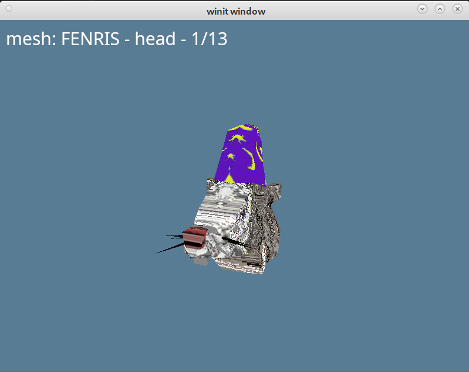

# Quest for Glory 5 reverse engineering

## Introduction

This project is an attempt to decode the various data files used by [Quest for Glory V: Dragonfire](https://en.wikipedia.org/wiki/Quest_for_Glory_V:_Dragon_Fire), an adventure/RPG-hybrid released by Sierra On-Line in 1998.

I am not the first person to take a deep dive into these datafiles. In fact, most of my own reverse engineering work was superseded by Kostya Shishkov's excellent work. I am therefore very grateful to all involved for their helpful work:

* [Kostya Shishkov's Quest for Glory V reverse engineering blog posts](https://codecs.multimedia.cx/category/qfg5re/)
* [Robert "GMFattay" Monnig's Quest for Glory Mods](https://qfgmods.net/qfgmods/Category_Quest_for_Glory_5.html)

My main contribution at this point is to implement tooling in [Rust](https://www.rust-lang.org/) to decode and/or visualise these file formats. I hope this will be useful to someone!

## Help wanted!

This project is incomplete! There are a few areas I could use help with:

- The textures in `.mdl` files do not seem to be correct
- The `.anm` rendering is not correct
- `.rgd` decoding is incomplete
- All formats should have a tool to decode/visualize them

Feel free to send me an [e-mail](mailto:rink@rink.nu) or create an issue/pull request! Your help is greatly appreciated.

## License

All work is licensed using the [GPL 3.0](LICENSE) license. If this is not acceptable for your use case, send me an [e-mail](mailto:rink@rink.nu) and I may be willing to relicense.

# In depth

## SPK files

All resources of Quest for Glory V are contained within three datafiles: `cda.spk`, `cdn.spk`, `hdn.spk` and `hdnw.spk`. These have a data structure similar to ZIP files and can be extracted using the [spk](src/bin/spk.rs) utility to individual files.

## File formats

The following table lists the available files, the tool(s) to interact with them and the status:

|Extension|Purpose|Status|Information|Tools|
|---------|-------|------|----|-----|
|`.anm`|3D model animations|✔️ File format structure decoded<br>❌ Resulting renders do not make sense<br>|[Kostya's analysis](https://codecs.multimedia.cx/2023/12/qfg5-leftover-formats/)|[dump_anm](src/bin/dump_anm.rs) [mdl_anm_viewer](src/bin/mdl_anm_viewer.rs)|
|`.aud`|Speech|Standard RIFF WAVE format|-|-|
|`.ftr`|Room regions definition|✅ File format mostly decoded<br>❌ Decoder not started|[Kostya's analysis](https://codecs.multimedia.cx/2023/11/qfg5-room-image-formats/)|-|
|`.gra`|2D sprite graphics|✅ File format mostly decoded<br>❌ Decoder not fully implemented|[Kostya's analysis](https://codecs.multimedia.cx/2023/11/qfg5-room-image-formats/)|[decode_gra](src/bin/decode_gra.rs)|
|`.img`|2D background image|✅ Mostly decoded and implemented|[Kostya's analysis](https://codecs.multimedia.cx/2023/11/qfg5-room-image-formats/)<br>[Robert's analysis](https://qfgmods.net/qfgmods/IMG_File_Format.html)|[image](src/bin/image.rs
|`.mdl`|3D model|✅ File format mostly decoded<br>❌ Textures look funny|[Kostya's analysis](https://codecs.multimedia.cx/2023/12/qfg5-model-format/)<br>[Robert's analysis](https://qfgmods.net/qfgmods/MDL_File_Format.html)|[dump_mdl](src/bin/dump_mdl.rs) [mdl_anm_viewer](src/bin/mdl_anm_viewer.rs)|
|`.nod`|2D palette data|✅ Mostly decoded and implemented|[Kostya's analysis](https://codecs.multimedia.cx/2023/11/qfg5-room-image-formats/)<br>[Robert's analysis](https://qfgmods.net/qfgmods/NOD_File_Format.html)|[image](src/bin/image.rs)|
|`.mov`|Intro and cutscenes|QuickTime movie format|-|-|
|`.qgf`|2D font|✅ File format mostly decoded and implemented|[Kostya's analysis](https://codecs.multimedia.cx/2023/11/qfg5-messages/)|[render_qgf](src/bin/render_qgf.rs)|
|`.qgm`|Text messages/dialog options|✅ File format mostly decoded and implemented|[Kostya's analysis](https://codecs.multimedia.cx/2023/11/qfg5-messages/)<br>[Robert's tool](https://qfgmods.net/qfgmods/Qfg5msg.html)|[dump_anm](src/bin/dump_anm.rs) [mdl_anm_viewer](src/bin/mdl_anm_viewer.rs)|
|`.rgd`|Room region information|✅ File format somewhat understood<br>❌ Not implemented|[Kostya's analysis, part 1](https://codecs.multimedia.cx/2023/11/qfg5-room-image-formats/)<br>[Kostya's analysis, part 2](https://codecs.multimedia.cx/2024/03/qfg5-rgd-revisited/)|[dump_rgd](src/bin/dump_rgd.rs)|
|`.rom`|Room properties|✅ File format mostly decoded<br>❌ Decoder not started|[Kostya's analysis](https://codecs.multimedia.cx/2023/11/qfg5-room-image-formats/)|-|
|`.snc`|Lipsync|✔ File format briefly understood<br>❌ Decoder not started|[Kostya's analysis](https://codecs.multimedia.cx/2023/11/qfg5-messages/)|-|
|`.spk`|Resource file|✅ File format understood and implemented|[Robert's notes](https://qfgmods.net/qfgmods/SPK_File_Format.html)<br>[Kostya's analysis](https://codecs.multimedia.cx/2023/11/qfg-spk-format/)|[spk](src/bin/spk.rs)|
|`.str`|Room star definitition|✅ File format mostly decoded<br>❌ Decoder not started|[Kostya's analysis](https://codecs.multimedia.cx/2023/11/qfg5-room-image-formats/)|-|
|`.wav`|Effects and music|Standard RIFF WAVE format|-|-|
|`.zzz`|2D room depth map|✅ Mostly decoded and implemented|[Kostya's analysis](https://codecs.multimedia.cx/2023/11/qfg5-room-image-formats/)|[image](src/bin/image.rs)|

Most files have either a 3-digit identifier or a 4/5-digit identifier - in case of the latter, the first 3 digits refer to the model (`.mdl`), room or image and the remaining digits are the index of the resource (`.anm` index, etc).

## mdl_anm_viewer

This tool attempts to visualize a 3D model (`.mdl`) with animation (`.anm`). You can execute it by running (063 is Fenris, Erasmus' familiar_:)

```sh
> cargo run --bin mdl_anm_viewer data/mdl/063.mdl data/anm/06300.anm
```

You can use the +/- keys to cycle between the available meshes. You should see something like this:



❗ Note that the texture coordinates seem to be wrong, this warrents investigation ❗

Within the viewer, you can use the following keys:

* _W/A/S/D_ moves the model
* _Q/E_ move the camera
* _Space_ toggles between mesh visualization and animation rendering
* _+/-_ cycle between the available meshes/animations
